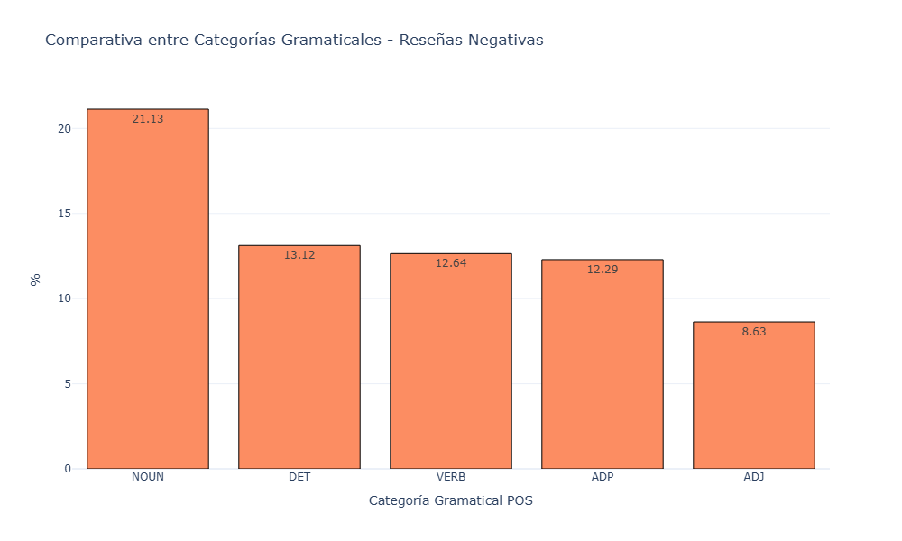
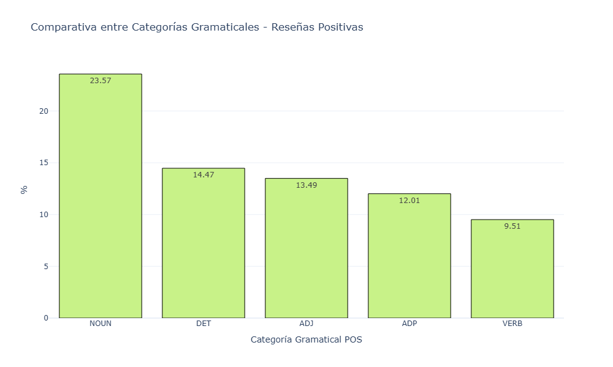
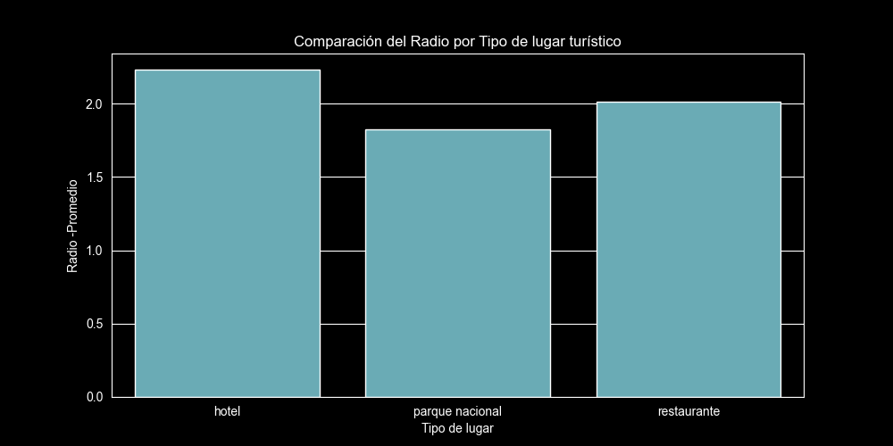

# Reporte de Hallazgos: Análisis de Reseñas y Tipos de Lugares Turísticos

**Fecha:** 11 de junio de 2026  
**Preparado por:** Fernando Contreras y Mónica Mendoza
---

## Resumen 
** Independientemente de las reseñas positivas o negativas, estas contienen varios conceptos de tipo sustantivo
* Realizando una interpretacion de los resultados de los graficos se observa que lo adjetivo tienen una caída drástica más que todo en las reseñas negativas.
* **Hoteles -mayor reseña** Los hoteles son los lugares turisticon con el mayor radio promedio registrado y seguido de el estan los restaurantes.

---

## Vista General de Métricas

---

## Hallazgos

### 1. Comportamiento Lingüístico en Reseñas Positivas contra las Negativas -NLP
#### Descripción
* En las **reseñas positivas**, en **Sustantivos (23.57%)**, **Determinantes (14.47%)** y **Adjetivos (13.49%)**. Segun estos resultados un discurso descriptivo y calificativo es enrequesido
* En las **reseñas negativas**, El sustantivo lidera (21.13%), los **Verbos (`VERB`) escalan a un tercer lugar con un 12.64%**, y por ultimo los **Adjetivos (`ADJ`) quedan en el final con apenas un 8.63%**.

#### Resumen de datos de Gráficos
* **Top 3 Positivas:** NOUN (23.57%) > DET (14.47%) > ADJ (13.49%).
* **Top 3 Negativas:** NOUN (21.13%) > DET (13.12%) > VERB (12.64%).

#### Conclusión 
En las reseñas según el estudio rrealizado se puede comprobar que la mayoria de usuarios utilizan más los verbos para describir una situacion o en vez de solo calificarlo a través de adjetivos 
---

### 2. Radio Promedio por Tipo de Lugar Turístico

#### Descripción
Según la evaluación realizada a la métrica de Radio Promedio entre los 3 tipos de destinos se puede observar que los lugares que incluyen el alojamiento y el consumo de alimentos son mayormente buscados por los usuario a comparación de lugares con reserva natural

#### Evidencia -Gréficos

---
